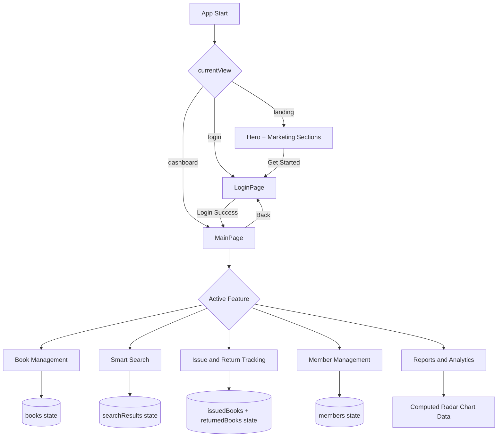

# Library Management System Architecture

## 1. System Overview

This project is split into two runtime parts:

- Frontend: React + Vite web app (port 5173)
- Backend: C++ HTTP server using WinSock2 (port 3001)

Current code status:

- The frontend UI is fully functional with local state management.
- The backend exposes REST endpoints with in-memory storage.
- Frontend-to-backend API wiring is not currently active in the React source.

## 2. High-Level Architecture (Flowchart)

```mermaid
flowchart LR
    U[User Browser] --> FE[React + Vite Frontend\nApp.jsx -> MainPage.jsx]

    FE --> FEState[Local UI State\nBooks, Issued, Returned, Members]
    FE --> Chat[Local Rule-Based Chat Assistant]

    FE -. optional REST integration .-> API[C++ REST API Server\nbackend/server.cpp\nPort 3001]

    API --> MemDB[(In-Memory Collections\nvector/map data)]
    API --> Endpoints[API Endpoints\n/books, /search, /issued-books, /returned-books, /members, /analytics]

    Setup[setup_database.bat + database_schema.sql] -. setup artifact .-> SQLite[(SQLite library.db)]
    SQLite -. not used by current server.cpp runtime .-> API
```

## 3. Frontend Internal Flow (Flowchart)



## 4. Backend Request Processing Flow (Flowchart)

```mermaid
flowchart TD
    Req[HTTP Request] --> Parse[Parse Method Path Body]
    Parse --> Route{Route Match}

    Route -->|GET /api/books| Books[booksToJson]
    Route -->|POST /api/books| AddBook[addBook]
    Route -->|DELETE /api/books/:id| DelBook[deleteBook]
    Route -->|GET /api/search?q=...| Search[searchBooks]
    Route -->|GET /api/issued-books| Issued[issuedBooksToJson]
    Route -->|GET /api/returned-books| Returned[returnedBooksToJson]
    Route -->|GET /api/members| Members[membersToJson]
    Route -->|GET /api/analytics| Analytics[analyticsToJson]
    Route -->|POST /api/issue-book| Issue[addIssuedBook]
    Route -->|POST /api/return-book| Return[returnBook]
    Route -->|No Match| NotFound[{error: Not found}]

    Books --> Resp[JSON Response + CORS Headers]
    AddBook --> Resp
    DelBook --> Resp
    Search --> Resp
    Issued --> Resp
    Returned --> Resp
    Members --> Resp
    Analytics --> Resp
    Issue --> Resp
    Return --> Resp
    NotFound --> Resp
```

## 5. Runtime Components

- Frontend entry: index.html -> src/main.jsx -> src/App.jsx
- Dashboard logic: src/components/MainPage.jsx
- Backend entry: backend/server.cpp (single-process socket loop)
- Build script: backend/build_and_run.bat
- Database setup files present: backend/setup_database.bat, backend/database_schema.sql

## 6. Data Model Snapshot

Backend runtime structs in server.cpp:

- Book
- IssuedBook
- ReturnedBook
- Member

Storage containers:

- vector<Book> books
- vector<IssuedBook> issuedBooks
- vector<ReturnedBook> returnedBooks
- vector<Member> members
- map<string, int> issuedAnalyticsCounts

## 7. Ports and Interfaces

- Frontend dev server: http://localhost:5173
- Backend API server: http://localhost:3001
- Protocol: HTTP/1.1 JSON APIs with permissive CORS headers

## 8. Notes and Gaps

- Current frontend does not call backend endpoints yet; it uses local state and local chatbot logic.
- Current backend runtime is in-memory only; data resets when server restarts.
- SQLite setup files exist, but server.cpp currently does not use sqlite3 APIs.

This architecture supports an easy next step: connect MainPage actions to backend endpoints and optionally migrate backend storage from in-memory vectors to SQLite for persistence.
